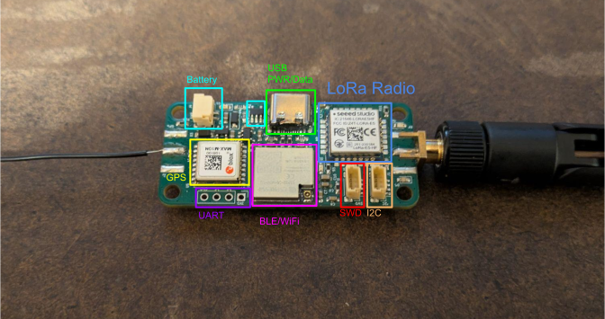

# telemetry-in-midair-rs
[Kicad Board](https://github.com/tmpk13/telemetry-in-midair) https://github.com/tmpk13/telemetry-in-midair

GPS tracker board firmware: a WIO-E5 (STM32WLE5) reads a MAX-M10 GPS,
broadcasts positions over 915 MHz LoRa and logs to SD, while an ESP32-C6
serves everything over BLE to the gps-gui-rs app and manages power. See
`PLAN.md` for the intent.

## Layout

| Directory | What | Target |
|-|-|-|
| `proto/` | Shared no_std protocol crate: ESP<->WIO UART link framing, LoRa payloads, BLE extensions, `radio.cfg` parser. Host-testable (`cargo test`). | any |
| `wio/` | WIO-E5 application firmware (RTIC). | `thumbv7em-none-eabi` (nightly) |
| `wio/bootloader/` | Two-partition swap bootloader for UART-fed firmware updates. | `thumbv7em-none-eabi` |
| `esp/` | ESP32-C6 firmware (embassy + trouble BLE). | `riscv32imac-unknown-none-elf` (stable) |
| `tools/` | Host uploader (Python/pixi) to flash the WIO through the ESP USB. | host |

Depends on the sibling repo `../gps-proto` for the BLE position protocol
and NMEA parsing (shared with `../esp32c3-gps` and `../gps-gui-rs`).

## Build and flash

**Using Pixi**
From `tools/` directory run
`pixi run esp-upload`
`pixi run wio-upload --address <#>`


**Directly running**
```sh
# protocol tests (host)
cd proto && cargo test

# WIO-E5: bootloader once, then the app (SWD via probe-rs)
cd wio && cargo run --release -p bootloader   # no RTT output; Ctrl-C once flashed
cd wio && cargo run --release                 # app, RTT console

# ESP32-C6 (USB Serial/JTAG; console also lives there)
# Per-frame link + per-heartbeat logging is on by default.
cd esp && cargo run --release
# same thing from the tools env:
cd tools && pixi run esp-upload
# compile the verbose call sites out entirely (code size, not logging):
cd esp && cargo run --release --no-default-features
```

## Configuring a board

`RADIO.example.toml` documents every setting. It is a reference, not a card
file - the firmware reads at most 1024 bytes of config and the descriptions
put it well over that, so the tool strips them before sending.

```sh
cd tools
pixi run wio-config --address 3                  # applied live, saved to SD
pixi run wio-config --set role=rx_only           # any key, repeatable
pixi run wio-config --set verbose=false          # quiet the ESP console
pixi run wio-config --address 3 --dry-run --save ../RADIO.CFG   # card file
```

A push replaces the whole config: keys absent from what is sent revert to
their defaults rather than keeping the board's current values, and there is
no way to read a config back off a board. Start from a file holding your
settings (`--file`) if the board is not on stock ones.

A pushed config is stored twice - `RADIO.CFG` on the card and a backup page
in the WIO's internal flash - so it survives a power cycle on a board with
no SD card. The card wins at boot, so editing `RADIO.CFG` on a computer
still works. The board reports which stores it reached, and `wio-config`
exits non-zero if a config went live but reached neither.

Note the WIO only has power while the ESP drives the LDO enable
(GPIO2) high - flash the ESP first or SWD/UART on the WIO will see a
dead chip.

`FW_VERSION=n` at build time stamps the WIO firmware version reported
over the link (used for update bookkeeping).

## Radio configuration

The WIO loads `RADIO.CFG` from the SD card at boot; the same file can be
pushed over BLE (bulk characteristic) at runtime, which also rewrites the
SD copy. All keys are optional; defaults in parentheses:

```toml
[radio]
frequency_hz = 915000000   # (915 MHz)
spreading_factor = 7       # 5-12 (7)
bandwidth_khz = 125        # 62|125|250|500 (125)
coding_rate = 5            # 4/5..4/8 (5)
power_dbm = 22             # -9..22 (22)
rx_boost = false           # boosted RX gain (false)
dcdc_enabled = true        # internal DC-DC instead of LDO (true)
tcxo_volts = "1.8"         # TCXO supply; board hardware, not a tuning knob
tcxo_startup_ms = 10       # TCXO settling wait, 1-1000 (10)

[network]
address = 1                # 1-255 (1)
role = "leaf"              # leaf | repeater (leaf)
max_hops = 1               # retransmissions allowed, 0-8 (1)

[beacon]
interval_s = 10            # position broadcast period, 0 = off (10)
fields = "lat,lon"         # what each broadcast carries (lat,lon); also
                           #   altitude|speed|course|sats|time

[sd]
sd_enabled = true          # use the SD card at all (true)

[gps]                       # MAX-M10 receiver (UBX-CFG-VALSET, RAM layer)
gps_enabled = true         # (true)
glonass_enabled = false    # (false); M10 tracks a limited concurrent set
galileo_enabled = true     # (true)
beidou_enabled = true      # (true)
qzss_enabled = true        # (true)
sbas_enabled = true        # (true)
power_mode = "full"        # full|psmoo|psmct (full)
meas_rate_ms = 1000        # measurement/nav period, 25-10000 (1000)
dynamic_model = "portable" # portable|stationary|pedestrian|automotive|
                           #   sea|airborne1g|airborne2g|airborne4g (portable)
```

### Beacon payload

`fields` decides what goes on the air. The default is position only: 13
bytes per frame against the 24 a full GPS packet costs, so roughly half the
air time on every broadcast. Altitude, speed, course, satellite count and
time are still recorded in `GPSLOG.CSV` whether or not they are transmitted
- the choice is only about what a *remote* receiver gets.

`lat` and `lon` are required; a config that omits either is rejected. The
selected set travels in the frame as a one-byte mask, so nodes configured
differently interoperate: a receiver decodes whatever each sender chose to
include, and fields nobody sent read back as zero.

Air time is the scarce resource on a shared band, and it grows with the
spreading factor - at SF12 a field costs about 32 times what it does at
SF7. Add fields when a receiver needs them, not by default.

### Leaves and repeaters

Every transmission is a broadcast and every node listens continuously, so
a fleet of plain leaves already works: each hears whichever others are in
direct range, and the defaults above need no changing. Setting `role =
"repeater"` on one node makes it retransmit what it hears, which is how
you cover ground no pair of leaves can reach across directly. Give a
repeater the elevation and the antenna - that, not the protocol, is where
the range comes from.

`max_hops` belongs to the *sender*: it is the number of retransmissions
that node's own broadcasts are allowed, stamped into each frame as it goes
out. A repeater forwards anything still carrying hops, so dropping one
into an existing fleet works without reconfiguring the nodes already
deployed. Frames are identified by sender and sequence number, so a frame
that arrives twice is handled once and two repeaters cannot bounce one
back and forth.

Each hop is another full transmission of the same frame on a shared
channel. `max_hops = 1` is the setting that pays; past 2 the traffic grows
faster than the coverage.

A frame is 3 header bytes plus the payload at its true length, with no
padding - a 20-byte position costs 24 bytes on air. Air time is the budget
that buys spreading factor, and spreading factor is the largest range knob
here (SF7 to SF12 is roughly 12 dB), so the framing is kept small to leave
room for a slow preset.

`rx_boost` is the one link-budget key that is not symmetric: it buys
roughly +2 dB of sensitivity on the node it is set on, and does nothing
for what that node transmits. Range is set by the worse of the two
directions, so it only helps where the receiving end is the weak one -
setting it on both nodes is the usual answer, at a few mA each while
listening. Every other radio key has to match across nodes to link at
all; this one does not.

The `[gps]` settings are pushed to the module as a single UBX-CFG-VALSET at
boot and again whenever a new config is applied (constellation, power and
model changes take effect live). Defaults match the M10 factory set, so an
absent section is a no-op.

## BLE

Same service UUID as the ESP32-C3 beacon, so gps-gui-rs discovers it
unchanged (device name `GPS-C6`). On top of the gps-proto position /
config / ack characteristics the C6 adds telemetry (LoRa RSSI/SNR,
counters, SD + fix flags), the last remote node position, a status/log
characteristic (notify + read), and a bulk write characteristic for TOML
config and WIO firmware images.

## Status updates

The WIO-E5 sends human-readable status lines to the ESP over the UART link
(`msg::LOG`) on notable events - boot, GPS presence (first NMEA / silent
module), GPS fix acquired/lost, soft sleep/wake, config applied, firmware
receive. The ESP prints each to its USB console (prefixed `wio:`) and
notifies it on the status/log characteristic, so gps-gui-rs (or any BLE
client) sees the same live log. Lines are ASCII, up to `link::LOG_MAX`
(64) bytes.

The WIO also prints a periodic GPS aliveness line to its own RTT console
(`gps: bytes=.. nmea=.. fix=.. sats=..`); a silent module (`bytes=0`)
usually means the ESP-controlled GPS/LoRa rail (GPIO2 LDO) is off rather
than a dead module. Build the WIO with `--features debug` to also dump
every raw NMEA line over RTT.

The ESP also pings the WIO (`cmd::PING`) every 3 s as a link heartbeat and
prints `wio link up` / `wio link down` on transitions, so a crashed or
mis-wired WIO shows on the console instead of just going silent. The
`verbose` cargo feature adds a line per inbound WIO frame and per heartbeat
ping (`cargo run --release --features verbose`).

The settings characteristic (`c3a10009-...`, read + notify) carries the
device's current power/sleep configuration as one 16-byte blob
(`midair_proto::ble::Settings`), so an app can populate its controls on
connect rather than assuming defaults. It is republished after every
config write - including values the device changed itself, such as a
clamped interval.

Config command ids (config characteristic, `[id, len, value]`):

| Id | Value | Effect |
|-|-|-|
| `0x01` | u32 ms | position notify interval (gps-proto) |
| `0x10` | u8 0/1 | GPS + LoRa power rail (LDO) off/on |
| `0x11` | u8 0/1 | WIO soft sleep (reset-pulse fallback on wake) |
| `0x12` | u8 0/1 | GPS backup mode (UBX-RXM-PMREQ / EXTINT wake) |
| `0x13` | u32 s | ESP deep-sleep wake-check interval, 5 s..5 min, 0 = off |
| `0x14` | u32 s | advertising window per wake check, 3 s..60 s (default 15 s) |

### Low power

`0x13` turns sleep on. While set, the C6 deep-sleeps whenever no central
is connected and wakes every interval to advertise for `0x14` seconds (one
long D2 blink). Both persist until changed - a connect does not clear
them, so an unattended board holds its cadence indefinitely and the
settings mean the same thing whether or not anyone is looking.

Together the two set the duty cycle, and so the average current:
advertising costs roughly two orders of magnitude more than deep sleep, so
the draw tracks window/interval almost exactly. The window is the more
useful knob of the two, because shortening it does not make the board any
slower to reach - a 5 s window at a 60 s interval is still four times the
battery life of the 15 s default, and still gets you a wake every minute.
What it costs is margin: the window has to overlap a phone's scan, and a
phone that only scans intermittently can miss several short windows in a
row. Unlike the interval, `0x14` has no "off" - a 0 clamps up to 3 s
rather than being stored as a window nobody could connect in.

A window changed over BLE applies from the next wake, not the current one.

The GPS/LoRa rail is **off** for the whole sleep and stays off through
the advertising window - a wake that nobody answers never powers the WIO
or GPS at all. The rail comes up only when a central actually connects
(and only if `0x10` has it enabled), so the app should expect the WIO's
boot time plus a GPS cold TTFF after connecting.

The interval, the window and the `0x10` rail setting are held in RTC RAM
and mirrored
to the ESP's `nvs` flash partition, so they survive deep sleep *and* a
flat battery - a board put away for transport comes back on the same
cadence rather than advertising until the cell dies again. Flash is read
only on a cold boot; wake checks run from the RTC RAM copy.

The wake is timed by the C6's uncalibrated RC slow clock, so the interval
drifts - it paces a wake-check, not a schedule.

**Deep sleep has no wake source but the timer.** Nothing over the air can
interrupt it: the radio is off, and there is no GPIO or button wake
configured. The 5 min ceiling on `0x13` is what bounds that - it is the
longest the board can ever be unreachable, short of a physical reset. A
reset does get you back sooner, but a cold boot restores the settings from
flash and the first advertising window is the same `0x14` seconds as any
other, so it buys you a window you chose the timing of rather than an
awake board.

## SD card

`GPSLOG.CSV` gets one line per own/remote fix
(`ms,src,lat_e7,lon_e7,alt_dm,speed_cms,course_cdeg,sats,fix,rssi`);
readable in any spreadsheet. The card is optional and hot-pluggable - when
none is present the driver retries the mount once a minute, so a card
inserted later starts logging within that. Only about the last 20 seconds of
positions are buffered in RAM while no card is mounted; anything older is
dropped. `sd_enabled = false` shuts the card down entirely.

Formatting: **MBR partition table, first partition FAT16 or FAT32**. That is
what a card of 32 GB or less already ships as, so most cards work untouched.
Larger (SDXC) cards ship exFAT, which is not supported and must be
reformatted - use the SD Association's SD Card Formatter, or on Linux make
an MBR partition of type `0c` and `mkfs.vfat -F 32 /dev/sdX1`. Formatting
the whole device (`/dev/sdX`, no partition) produces a card the driver
cannot mount. GPT is not supported either.

Both filenames are MS-DOS 8.3 - eight characters plus a three-character
extension - which is why the config file is `RADIO.CFG` and not
`RADIO.TOML`. The FAT layer converts a name to 8.3 before looking it up, so
a longer name is not a missing file but one that can never be opened.

## WIO firmware update

The update paths take a raw image (objcopy of the ELF). The ESP-USB
uploader below builds it for you; to build it by hand (e.g. for the BLE
path):

```sh
cd wio && cargo objcopy --release -- -O binary wio-e5-gps.bin
```

Either path streams it over the UART link into the WIO's DFU partition (D2
blinks rapidly); on a verified CRC the WIO reboots and the swap bootloader
installs it power-fail-safely, reverting automatically if the new image
never confirms boot. SWD via the J5 header remains as the recovery path.

**Over BLE:** push the `.bin` through the bulk characteristic (`OP_BEGIN`
kind 2 with size/crc32/version, `OP_DATA` chunks up to 192 bytes,
`OP_END`).

**Over the ESP USB:** the same bulk protocol is exposed on the USB
Serial/JTAG port (framed with the link framing, `link::usb` commands), so a
computer can flash the WIO through the ESP with no BLE. A host uploader
lives in `tools/`. It builds the image, auto-detects the ESP port and
uploads, so no arguments are needed:

```sh
cd tools && pixi run fw-upload      # --no-build to skip the rebuild
```

The ESP console shares the USB port; the uploader's frame parser resyncs
past the console text. Only one transfer (BLE or USB) runs at a time.

## ESP32-C6
`ESP32-C6-MINI-1U-H4`
`4MB Flash`

| Pin | Function |
|-|-|
| I03 | LED D2 |
| IO2 | PWR EN GPS/Radio (AP2112K-3.3) |
| IO4 | RX/GPIO |
| IO5 | TX/GPIO |
| IO6 | WIO-E5 RST |
| RXD0 | WIO-E5 PA2 |
| TXD0 | WIO-E5 PA3 |
| IO12 | USB D- |
| IO13 | USB D+ |

*Boot pad on back*

## WIO-E5

| Pin | Function |
|-|-|
| PB6 (TX) | GPS RX |
| PB7 (RX) | GPS TX |
| PB10 | EXT INT GPS |
| PC1 | I2C SCL (JST SH) |
| PC1 | I2C SDA (JST SH) |
| PB3 | SD SCK |
| PB4 | SD CITO |
| PB5 | SD COTI |
| PA0 | SD CS |
| PA9 | LED D6 |
| PA10 | LED D5 |

*Reset (RST) pad on back*


## Connectors
#### JST SH
*As of Version 1*

**I2C** *(J6)*

| Pin | Function |
|-|-|
| 4 | SCL |
| 3 | SDA |
| 2 | 3V3 |
| 1 | GND |

**SWD** *(J5)*

| Pin | Function |
|-|-|
| 4 | SWDIO |
| 3 | SWDCLK |
| 2 | 3V3 |
| 1 | GND |


Inital WIO wipe:
`openocd -f interface/cmsis-dap.cfg -f target/stm32wlx.cfg -c "init; reset halt; stm32l4x unlock 0; reset halt; exit"`

Power cycle after wiping before attempting to upload.


## Charging IC 

`MCP73831T-2ACI/OT`
4.2 V
Adjustable current. 500 mA @ 2k ohm programming resistor.


## Inital power testing 

Everything running (BLE connected, Satalite fix, SD logging)
`75 mA`
Everything running no SD (BLE connected, Satalite fix, pulse on LoRa TX)
`66 mA`

Fully running (BLE connected, Satalite fix, pulse on LoRa TX, SD logging)
`120 mA`

ESP only BLE connected
`46 mA`

GPS Board v1
